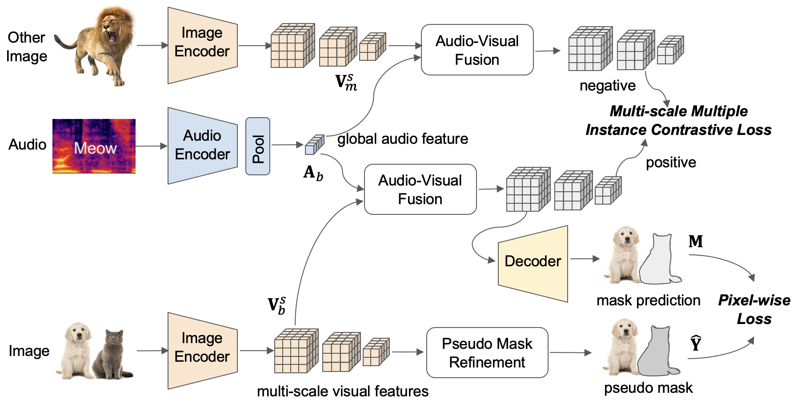

# Weakly-Supervised Audio-Visual Segmentation

Official implementation for "Weakly-Supervised Audio-Visual Segmentation".

WS-AVS is a new baseline for the new problem, weakly-supervised audio-visual segmentation, which predicts segmentation masks for sounding objects in the frames without pixel-level annotations.

<div align="center">
  
</div>

## Environment

To setup the environment, please simply run

```
pip install -r requirements.txt
```

## Datasets

###  AVSBench

Data can be downloaded from [Audio-Visual Segmentation](https://github.com/OpenNLPLab/AVSBench)

###  Pseudo Masks

Pseudo masks of training frames can be generated from [C2AM: Contrastive learning of Class-agnostic Activation Map for Weakly Supervised Object Localization and Semantic Segmentation](https://github.com/CVI-SZU/CCAM)


## Model Zoo

We release WS-AVS model pre-trained on AVSBench data and scripts on reproducing weakly-supervised results on AVSBench audio-visual segmenation benchmark.

| Method |    Train Set   |     Test Set    |     mIoU     |  F-score  | url | Train | Test |
|:------:|:--------------:|:---------------:|:------------:|:-----:|:---:|:----:|:----:| 
| WS-AVS | AVSBench Train | AVSBench Test |     34.13    | 51.76 | [model](https://drive.google.com/file/d/1kgUtvQufJa7c6o-08xuRqvAnTUXP4_7I/view?usp=sharing) | [script](./scripts/train.sh) | [script](./scripts/test.sh) |


## Train & Test

For training an WAVS model, please run

```
python train.py --multiprocessing_distributed \
    --train_data_path /path/to/avsbench/train/ \
    --train_pseudo_gt_path /path/to/train/pseudo_gt_masks \
    --test_data_path /path/to/avsbench/val/ \
    --test_gt_path /path/to/avsbench/val/gt_masks \
    --experiment_name wsavs_avsbench \
    --model 'wsavs' \
    --weight_msmil 1. \
    --weight_pixel 1. \
    --imgnet_type resnet50 --audnet_type resnet50 \
    --trainset 'avsbench' \
    --testset 'avsbench' \
    --epochs 20 \
    --batch_size 64 \
    --init_lr 0.0001 \
    --dropout_img 0.9 --dropout_aud 0
```


For testing and visualization, simply run

```
python test.py --multiprocessing_distributed \
    --test_data_path /path/to/avsbench/test/ \
    --test_gt_path /path/to/avsbench/test/gt_masks \
    --experiment_name wsavs_avsbench \
    --model 'wsavs' \
    --imgnet_type resnet50 --audnet_type resnet50 \
    --trainset 'avsbench' \
    --testset 'avsbench' \
    --save_pred_masks
```
